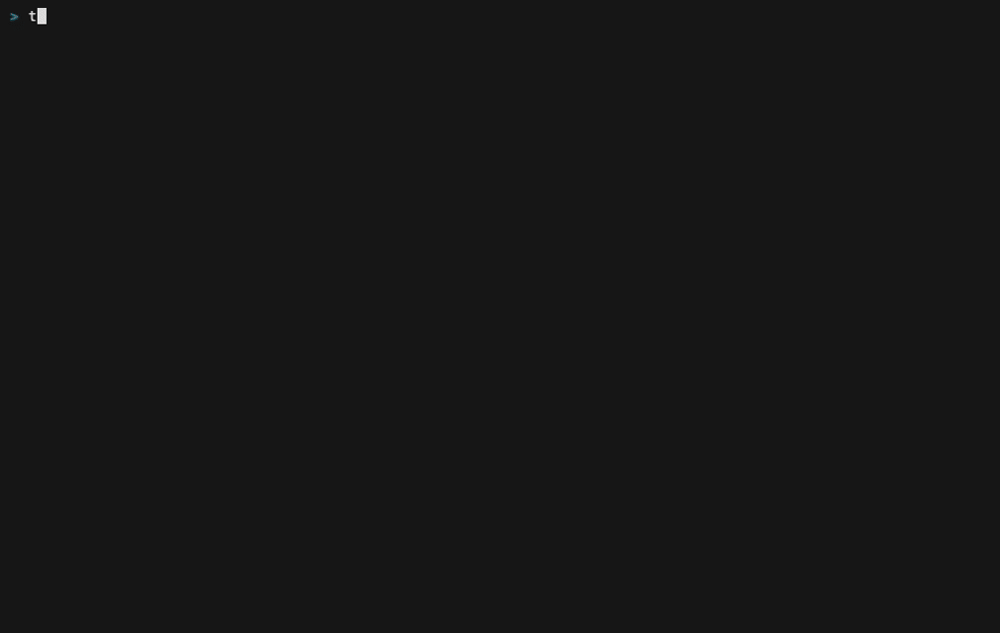
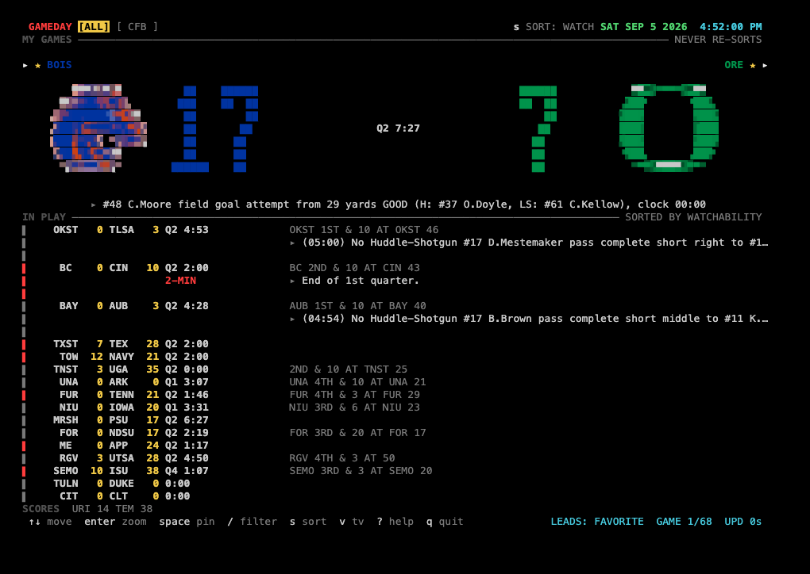

# gameday

A terminal sports board that ranks live games by watchability. Nine leagues, no account, one binary.



## Install

Available from 1.0.0; until then: `cargo install --git https://github.com/WallyMagill/gameday`

```bash
brew install WallyMagill/tap/gameday
cargo install gameday
curl --proto '=https' --tlsv1.2 -LsSf https://github.com/WallyMagill/gameday/releases/latest/download/gameday-installer.sh | sh
```

Or grab a binary from [Releases](https://github.com/WallyMagill/gameday/releases).

## The sixty-second tour



1. **The ranked list** — below MY GAMES, every live and upcoming game across your enabled leagues, most watchable first; the section rule names the order (`SORTED BY WATCHABILITY`).
2. **The hero** — the top-ranked game's own panel: both teams' marks, the score, and the clock, drawn big.
3. **The chip** — a state label riding the hero or a row (`2-MIN`, `RED ZONE`, …) when a game crosses into a more watchable moment.
4. **The situation fragment** — the down/distance/field-position (or its equivalent) beside a live row, e.g. `OKST 1ST & 10 AT OKST 46`.
5. **The last play** — the `►`-prefixed line under the hero, the scoreboard's own last-play text; at 160 columns or wider it rides the same line as the situation fragment on every live row.
6. **MY GAMES with ★** — pinned and favorited games get their own section above the ranked list; ★ marks the favorited team.
7. **The footer's LEADS** — bottom right, names why the top game leads (`LEADS: FAVORITE`, a ranked matchup, live win probability, …).

## Keys

| Mode | Keys |
|---|---|
| Board | `space` pin · `t` favorite home team · `z`/`enter` zoom · `s` sort · `v` tv · `c` theme picker · `/` filter · `[`/`]` date |
| Zoom | `h`/`l` or `[`/`]` tabs (OVERVIEW · PLAYS · STATS) |
| TV | `space` lock · `n` next |
| Config | `space` toggle · `enter` edit · `h`/`l` cycle |
| Standings & feed | the everywhere and paging sets below — no keys of their own |
| Paging | `pgdn`/`pgup`, `ctrl-d`/`ctrl-u` half a page · `g`/`G`, `home`/`end` to the ends |
| Everywhere | `tab`/`shift-tab`/`h`/`l` league · `j`/`k` move · `esc`/`q` back · `:` command · `r` refresh · `?` help · `q`/`ctrl-c` quit |

`:` commands: `:nfl` `:cfb` `:cbb` `:nba` `:wnba` `:nhl` `:mlb` `:epl` `:mls` (jump to a league) · `:home`/`:all` · `:plays` · `:standings [league]` · `:config` · `:theme [name]` · `:sort [key]` · `:tv` · `:pin <abbr>` · `:notify test` · `:help` · `:q`/`:quit`

## Config

`~/.config/gameday/config.toml` (or `$XDG_CONFIG_HOME/gameday`; `--config-dir <path>` overrides either). `pins.json`, `gameday.log`, `cache/` and `themes/` live beside it. Older installs on macOS: the app reads `~/Library/Application Support/gameday` until you move it.

| Key | Default | Values |
|---|---|---|
| `enabled_tabs` | all nine leagues | `["Nfl", "Cfb", "Cbb", "Nba", "Wnba", "Nhl", "Mlb", "Epl", "Mls"]` |
| `favorites` | `[]` | entries `{ league = "Nfl", team_abbr = "KC" }` |
| `theme` | `"broadcast"` | `broadcast` \| `studio` \| `gruvbox` \| `daygame`, or a file in `themes/` |
| `sort` | `"watch"` | `watch` \| `time` \| `league` |
| `notify` | `["favorites", "pins"]` | `[]` turns notifications off |

A `config.toml` that doesn't parse is reported with its file, line and the expected value — the board runs on defaults and saves nothing until you fix it. Old `layout` and `score_style` keys from before v3.2 are ignored if present.

### Themes

Four built-ins: **broadcast** (the default — amber scores, colored chrome), **studio** (the press box: grayscale plus exactly one red, white scores), **gruvbox** (the one warm-ground community palette), and **daygame** (the one light theme — warm paper ground, dark ink, for a desk in daylight next to a browser). A theme is a palette read through *roles* — `ground`, `ink`, `dim`, `digits`, `hot`, `cool` and a `team` scope saying where team color is allowed — so two themes can share every hue and still be two looks.

Drop a `.toml` in `<config-dir>/themes/` and it loads at startup; a file that names a built-in replaces it. Eight more palettes — `ceefax`, `phosphor`, `tokyo-night`, `nord`, `catppuccin-mocha`, `rose-pine`, `everforest`, `dracula` — ship in `assets/themes/` and load the same way, so `theme = "nord"` keeps working once you copy that file across. A broken file is skipped with a line naming the file, the key and the expected form; the board keeps running.

## Notifications

A desktop notification fires when a favorite scores or a pinned/favorite game goes final. macOS sends it via `osascript`; Linux via `notify-send` when it's on PATH; anywhere else, notifications are off and the reason is logged once. Turn them off entirely with `notify = []`. `:notify test` sends one through whatever backend is installed so you can check it actually reaches you.

## `--once` and `--json`

`gameday --once` fetches once, prints the ranked board, and exits — no terminal, no poll loop.

```
gameday --once [--json] [--league L]... [--live] [--top N] [--color]
```

`--json` prints this schema (drops `--color` — scripts get plain data):

```json
{
  "generated_at": "RFC3339",
  "stale": false,
  "games": [
    {
      "league": "nfl",
      "id": "...",
      "status": "live|pre|final",
      "period": "Q4",
      "clock": "1:27",
      "start": "RFC3339 or null",
      "away": { "abbr": "...", "name": "...", "score": 0, "record": "...", "rank": null },
      "home": { "abbr": "...", "name": "...", "score": 0, "record": "...", "rank": null },
      "watch": { "score": 0, "chip": "RED ZONE or null", "why": "..." },
      "situation": "... or null",
      "last_play": "... or null",
      "pinned": false
    }
  ]
}
```

A status-bar recipe (tmux, polybar, whatever reads a shell command):

```bash
#(gameday --once --live --top 1 --league mlb | tail -1)
```

Exit codes: `0` with output printed (nothing printed at all when there's nothing to show), `1` when every requested league failed and nothing was cached (one line on stderr), `2` for argument errors. At 160 columns or wider, `--once` text carries each live row's last play on the same line as its situation, exactly like the board.

## Data

Unofficial ESPN JSON (`site.web.api.espn.com`), polled — never a websocket. The last good payload stays on disk, so a network failure shows `STALE` instead of going blank. Measured with nine leagues live: 38 requests a minute, scoreboards only; a full summary (play-by-play, box score) is fetched only for the game you zoom and for a one-shot scoring catch-up.

Team marks are quadrant-block renderings of league-owned logos, used only to identify teams; gameday is not affiliated with ESPN or any league, and a mark comes down on request. College now ships every FBS school plus eight D-I basketball conferences (ACC, Big East, Big Ten, Big 12, SEC, Atlantic 10, Mountain West, American) — 165 marks in all. A team without a committed mark falls back to its abbreviation painted in its own colors, which is the designed look, not a gap.

## Terminals

Developed and used day to day in Ghostty and tmux on macOS. Terminal.app and iTerm2 get a spot check at each release candidate — not continuously verified. Windows builds are untested.

**Troubleshooting**
- Digits look wrong → a font fallback issue: the board draws only `▀▄█`, which every mono font has, so this usually means the terminal itself isn't using a mono font.
- No notifications → check the OS notification settings for your terminal (macOS: System Settings → Notifications; Linux: whatever reads `notify-send`).
- `STALE` in the header → the network fetch failed; the board is showing the last good payload from disk.

## Contributing

See [`docs/dev.md`](docs/dev.md) for the build, the design loop, the capture tools, and the release procedure.

## License

MIT OR Apache-2.0.
